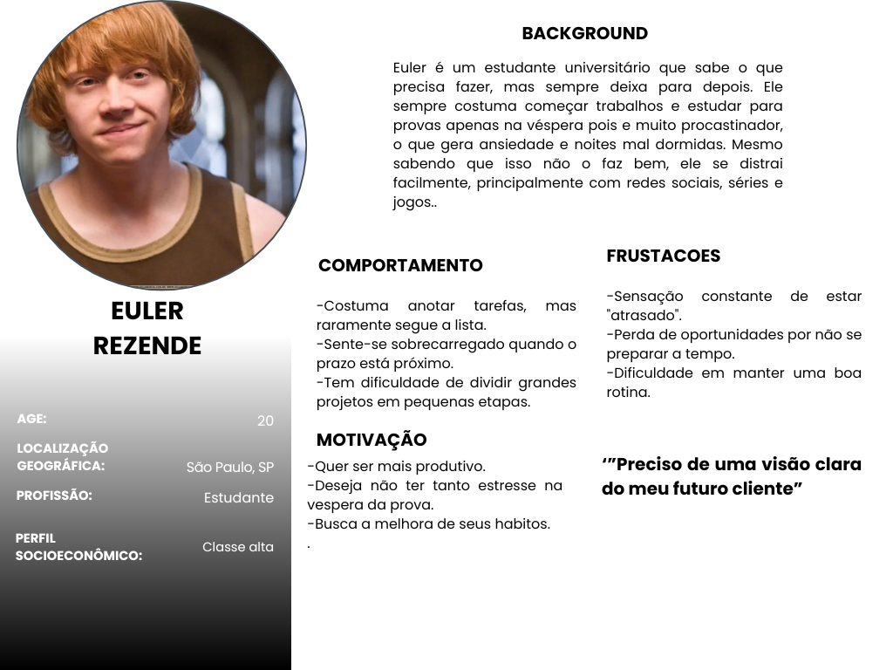
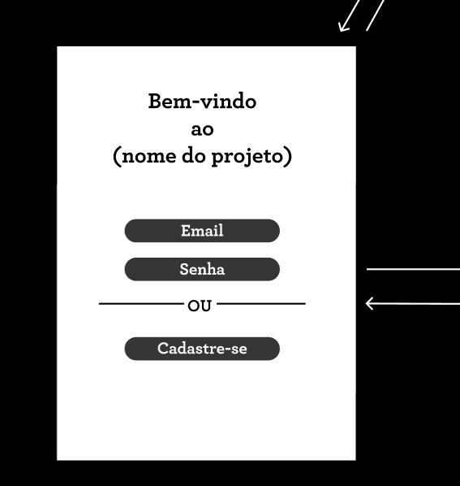
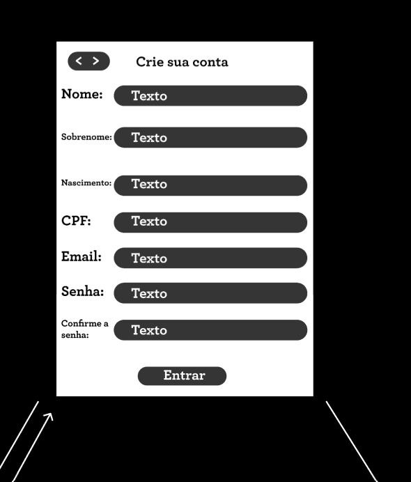
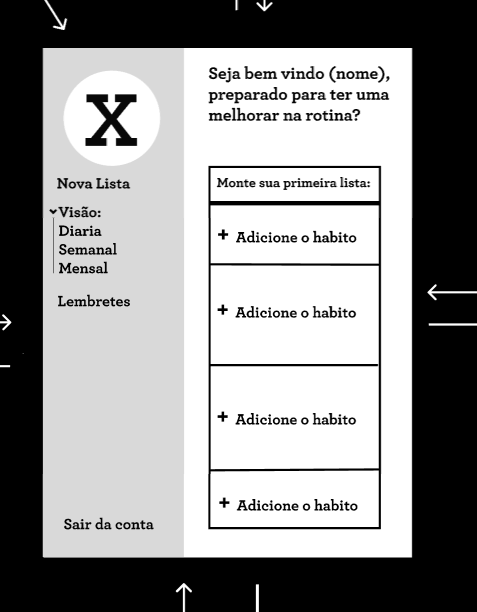
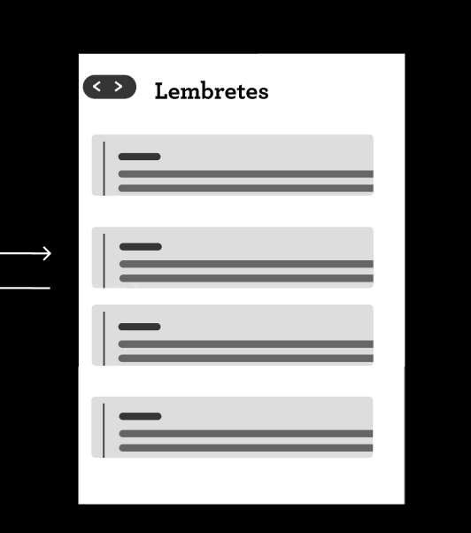
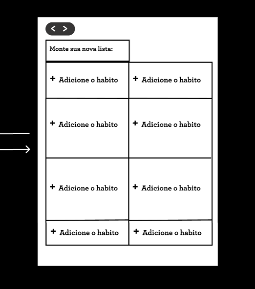
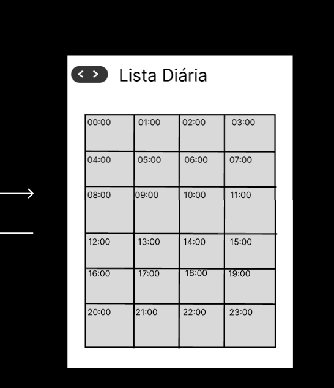
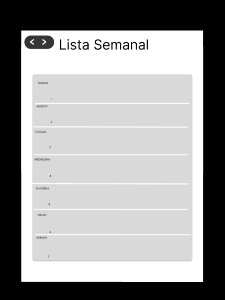
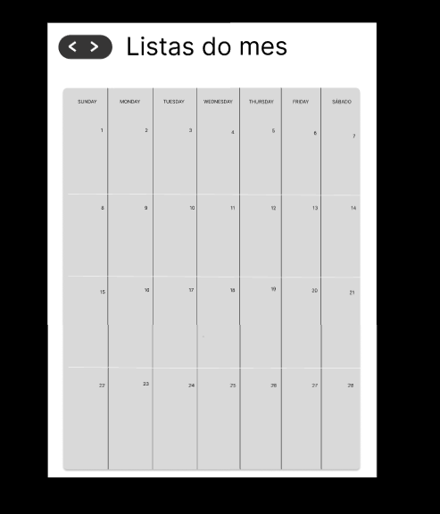
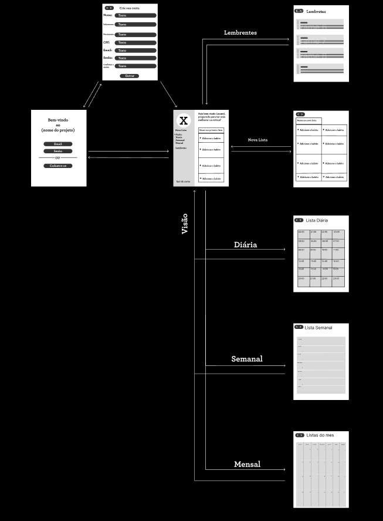

# Web Application Document - Projeto Individual - Módulo 2 - Inteli

**_Os trechos em itálico servem apenas como guia para o preenchimento da seção. Por esse motivo, não devem fazer parte da documentação final._**

## Nome do Projeto

#### Autor do projeto

## Sumário

1. [Introdução](#c1)  
2. [Visão Geral da Aplicação Web](#c2)  
3. [Projeto Técnico da Aplicação Web](#c3)  
4. [Desenvolvimento da Aplicação Web](#c4)  
5. [Referências](#c5)  

 

## 1. Introdução (Semana 01)

Neste projeto desenvolver um sistema de gerenciamento de tarefas, focando na organização pessoal e no aumento da produtividade. Viso utilizar este, os usuários poderão criar, editar, excluir e organizar suas tarefas de maneira fácil e rápida; elas serão organizadas conforme prioridade, data de entrega e vão classificar por  status( pendente, em andamento ou concluído). Terá disponível uma interface intuitiva, possibilitando a visualização da tarefa em lista ou quadros ,parecido com o modelo do kanban, o que possibilita o monitoramento do andamento. Além das notificações para lembretes de prazo, também permitirão filtros para pesquisar de maneira mais eficaz as tarefas. O sistema terá um objetivo para diminuir a procrastinação e oferecer uma alternativa fácil e intuitiva a ser usada no dia-a-dia para estudos, trabalho ou qualquer outro tipo de processo pessoal.

---

## 2. Visão Geral da Aplicação Web

### 2.1. Personas (Semana 01)

 

Foto da persona
 
 

 
 
Fonte: Material produzido pelos autores (2025)

 

Nome: Euler Rezende

Idade: 20 anos

Curso: Administração

Perfil: Euler é um estudante universitário que sabe o que precisa fazer, mas sempre deixa para depois. Ele sempre costuma começar trabalhos e estudar para provas apenas na véspera pois e muito procastinador, o que gera ansiedade e noites mal dormidas. Mesmo sabendo que isso não o faz bem, ele se distrai facilmente, principalmente com redes sociais, séries e jogos.

Comportamento:

-Costuma anotar tarefas, mas raramente segue a lista.

-Sente-se sobrecarregado quando o prazo está próximo.

-Tem dificuldade de dividir grandes projetos em pequenas etapas.

Motivações:

-Quer ser mais produtivo.

-Deseja não ter tanto estresse na vespera da prova.

-Busca a melhora de seus habitos.

Frustrações:

-Sensação constante de estar "atrasado".

-Perda de oportunidades por não se preparar a tempo.

-Dificuldade em manter uma boa rotina.

### 2.2. User Stories (Semana 01)

US01 | Como usuário, quero criar, editar e excluir tarefas, para que eu possa gerenciar melhor minhas atividades diárias.

US02 | Como usuário, quero classificar as tarefas por prioridade e prazo, para que eu possa focar primeiro nas tarefas mais urgentes e importantes.

US03 | Como usuário, quero visualizar minhas tarefas em formato de quadro kanban, para que eu possa acompanhar facilmente o andamento de cada atividade.

Análise INVEST da User Story US01
US01 | Como usuário, quero criar, editar e excluir tarefas, para que eu possa organizar minhas atividades.

I – Independente: Não depende de outras funções.

N – Negociável: Pode ser ajustada conforme necessário.

V – Valiosa: É essencial para o usuário organizar o que precisa fazer.

E – Estimável: É fácil calcular o tempo de desenvolvimento.

S – Pequena: Pode ser feita em pouco tempo.

T – Testável: Dá para testar criando, editando e excluindo tarefas.

---

## 3. Projeto da Aplicação Web

### 3.1. Modelagem do banco de dados  (Semana 3)

*Posicione aqui os diagramas de modelos relacionais do seu banco de dados, apresentando todos os esquemas de tabelas e suas relações. Utilize texto para complementar suas explicações, se necessário.*

*Posicione também o modelo físico com o Schema do BD (arquivo .sql)*

### 3.1.1 BD e Models (Semana 5)
*Descreva aqui os Models implementados no sistema web*

### 3.2. Arquitetura (Semana 5)

*Posicione aqui o diagrama de arquitetura da sua solução de aplicação web. Atualize sempre que necessário.*

**Instruções para criação do diagrama de arquitetura**  
- **Model**: A camada que lida com a lógica de negócios e interage com o banco de dados.
- **View**: A camada responsável pela interface de usuário.
- **Controller**: A camada que recebe as requisições, processa as ações e atualiza o modelo e a visualização.
  
*Adicione as setas e explicações sobre como os dados fluem entre o Model, Controller e View.*

### 3.3. Wireframes (Semana 03)

 

Login
 
 

 
 
Fonte: Material produzido pelos autores (2025)

 
----------

 

Cadastro
 
 

 
 
Fonte: Material produzido pelos autores (2025)

 
----------

 

tela inicial
 
 

 
 
Fonte: Material produzido pelos autores (2025)

 
----------

 

Lembretes
 
 

 
 
Fonte: Material produzido pelos autores (2025)

 
----------

 

Nova lista
 
 

 
 
Fonte: Material produzido pelos autores (2025)

 
----------

 

lista diaria
 
 

 
 
Fonte: Material produzido pelos autores (2025)

 
----------

 

lista semana
 
 

 
 
Fonte: Material produzido pelos autores (2025)

 
----------

 

lista mes
 
 

 
 
Fonte: Material produzido pelos autores (2025)

 
----------

 

Wireframa inteiro
 
 

 
 
Fonte: Material produzido pelos autores (2025)

 
----------

https://www.figma.com/design/mgrzrAlEB3nWsHy0Y6y6m9/Untitled?node-id=0-1&t=QlKaFikn6DfYV655-1

### 3.4. Guia de estilos (Semana 05)

*Descreva aqui orientações gerais para o leitor sobre como utilizar os componentes do guia de estilos de sua solução.*

### 3.5. Protótipo de alta fidelidade (Semana 05)

*Posicione aqui algumas imagens demonstrativas de seu protótipo de alta fidelidade e o link para acesso ao protótipo completo (mantenha o link sempre público para visualização).*

### 3.6. WebAPI e endpoints (Semana 05)

*Utilize um link para outra página de documentação contendo a descrição completa de cada endpoint. Ou descreva aqui cada endpoint criado para seu sistema.*  

### 3.7 Interface e Navegação (Semana 07)

*Descreva e ilustre aqui o desenvolvimento do frontend do sistema web, explicando brevemente o que foi entregue em termos de código e sistema. Utilize prints de tela para ilustrar.*

---

## 4. Desenvolvimento da Aplicação Web (Semana 8)

### 4.1 Demonstração do Sistema Web (Semana 8)

*VIDEO: Insira o link do vídeo demonstrativo nesta seção*
*Descreva e ilustre aqui o desenvolvimento do sistema web completo, explicando brevemente o que foi entregue em termos de código e sistema. Utilize prints de tela para ilustrar.*

### 4.2 Conclusões e Trabalhos Futuros (Semana 8)

*Indique pontos fortes e pontos a melhorar de maneira geral.*
*Relacione também quaisquer outras ideias que você tenha para melhorias futuras.*

## 5. Referências

_Incluir as principais referências de seu projeto, para que seu parceiro possa consultar caso ele se interessar em aprofundar. Um exemplo de referência de livro e de site:_ 

---
---
